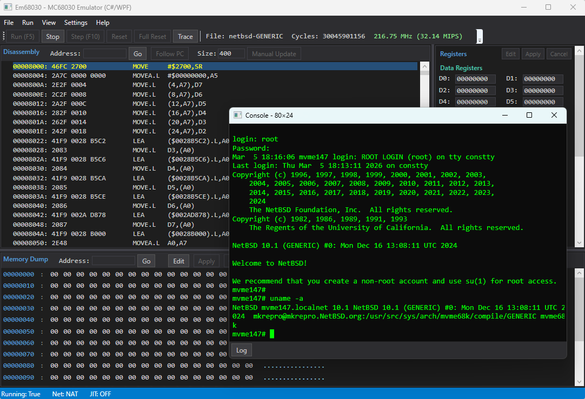

# Em68030 - MC68030 Emulator (C# / WPF)

[Motorola MC68030](https://en.wikipedia.org/wiki/Motorola_68030) マイクロプロセッサのエミュレータです。MC68030 は 1980 年代後半にワークステーションや組み込みシステムで広く使われた 32-bit CPU です。本エミュレータは MC68030 を搭載した VMEbus シングルボードコンピュータ [MVME147](https://en.wikipedia.org/wiki/MVME147) をエミュレートし、NetBSD の mvme68k ポートである [NetBSD/mvme68k](https://www.netbsd.org/ports/mvme68k/) を起動できます。

[Claude Code](https://docs.anthropic.com/en/docs/claude-code) との vibe coding により開発されました。

[English documentation (README.md)](README.md)

<a href="docs/screenshot_jit_off.png"></a>

**ドキュメント**: [はじめに](docs/getting_started_ja.md) | [命令セット一覧](docs/instruction_set_ja.md) | [ハードウェアプラットフォーム](docs/hardware_platform_ja.md)

## 特徴

### CPU エミュレーション
- MC68030 の全命令セット (特権命令を含む)
- MMU (ページテーブルウォーク、ATC、透過変換、PTEST)
- MC68882 互換 FPU (FP0-FP7、FPCR/FPSR/FPIAR)
- バスエラー回復 (Format A スタックフレーム)

### ボードエミュレーション (MVME147)
| デバイス | エミュレーション |
|---|---|
| WD33C93 SCSI コントローラ | ハードディスク・CD-ROM (複数台) |
| AM7990 LANCE Ethernet | 仮想ネットワーク (ARP/ICMP/TCP/UDP) / NAT (ホストネットワーク) |
| Z8530 SCC シリアル | VT100 ターミナルエミュレーション |
| Mk48t02 RTC | リアルタイムクロック |
| PCC | 割り込みコントローラ、実時間タイマー |

### デバッガ UI
- 逆アセンブリビュー (PC 自動追従、アドレスジャンプ)
- レジスタ表示・編集 (D0-D7, A0-A7, PC, SR, SSP, VBR, FP0-FP7)
- メモリダンプ・編集
- ブレークポイント
- コンソールウィンドウ (VT100 ターミナル、スクロールバック・ペースト対応)
- ELF / S-Record / バイナリファイルの読み込み
- ウォームリブート (RESET 命令) およびハルト検出

### パフォーマンス
Intel Core i7-13700 上で約 32.14 MIPS (概算約 216.75 MHz) のエミュレーション速度を達成。ステータスバーに概算 MHz (サイクルベース) と MIPS (命令スループット) を併記表示します。主な最適化:

- 65,536 エントリのオペコードデリゲートテーブル
- 頻出命令の専用ファストハンドラ (MOVEQ, MOVE.L, Bcc.B, RTS 等)
- ATC 直接参照のインライン高速パス
- データページキャッシュ (1 エントリ読み取りキャッシュ)
- 概算サイクルテーブル (65,536 エントリのルックアップ + EA コスト計算)

インタープリタ方式のため、1 命令あたりホスト CPU で多数のサイクルを消費します。C# の JIT コンパイラによるメソッドインライン化には限界があり、C++ ネイティブ版と比較して約 20% 低い速度となります。

### JIT コンパイラ (実験的機能)

`System.Reflection.Emit` を使用して、レジスタ間操作のみで構成される基本ブロックを実行時に .NET IL へコンパイルするオプション機能です。Settings > Performance から有効化できます。ステータスバーに現在の JIT 状態 ("JIT: ON" / "JIT: OFF") が表示されます。

**対応命令**: MOVEQ, MOVE.L Dn→Dm, MOVE.L An→Dn, MOVEA.L Dn→An, MOVEA.L An→Am, CLR.L Dn, TST.L Dn, ADD/SUB/CMP.L Dn→Dm, AND/OR/EOR.L Dn→Dm, ADDQ/SUBQ.L Dn, ADDQ/SUBQ An, ASL/ASR/LSL/LSR.L #imm Dn, EXG Dn↔Dm/An↔Am/Dn↔An, SWAP Dn, EXT.W/EXT.L/EXTB.L Dn, NEG.L Dn, NOT.L Dn, Bcc.B, BRA.B, NOP

**現状**: 本機能は実験的であり、**デフォルトで無効**です。現在の実装では、JIT を有効にするとエミュレーション速度が約 32 MIPS から約 31 MIPS に低下します。ExecuteNextJit の NoInlining メソッド呼出オーバーヘッド + block.Execute() の DynamicMethod デリゲートディスパッチコストがコンパイル済みブロックの恩恵を上回っています。コンパイル可能ブロックが実際のコードのごく一部しかカバーしていないことが根本原因です。

**既知の問題と今後の改善計画**:

| 課題 | 説明 | 改善の方向性 |
|---|---|---|
| コンパイル対象範囲が狭い | レジスタ間命令のみコンパイル可能。メモリアクセス命令 (実コードの大部分) はインタープリタにフォールバック | メモリアクセス命令 (例: MOVE.L (An),Dn) への対応拡大。コンパイル済みブロック内でのバスエラー処理が必要 |
| 毎命令のディスパッチオーバーヘッド | ブロック検索のインライン化と分岐予測による JIT パス選択を実装済みだが、JIT 有効時の実行パスはメソッド本体のサイズ増加により .NET JIT のインライン化に影響し、純粋なインタープリタより約 8% 遅い | 対応命令の拡充により JIT ブロックヒット率を向上させ、毎命令のオーバーヘッドを相殺 |
| 特権遷移時のコスト | ユーザ/スーパーバイザモード切替のたびに JIT キャッシュ全体を無効化する必要がある (MMU アドレス空間が異なるため) | 特権レベル別のキャッシュ分離、またはブロックに特権モードタグを付与 |
| 後方分岐が非対応 | ループの後方分岐は無限ループ誤検出を避けるため JIT ブロックから除外されている | ループ検出機構を JIT 対応に再設計し、コンパイル済み後方分岐を許可 |

## 必要環境

- Windows 10 以降
- .NET 8.0 SDK

## ビルド

```bash
dotnet build Em68030/Em68030.csproj -c Release
```

## テスト

```bash
dotnet test Em68030.Tests/Em68030.Tests.csproj -c Release
```

## 実行

```bash
dotnet run --project Em68030/Em68030.csproj -c Release
```

初回起動後、Settings メニューから `appsettings.json` が生成されます。

> **注意**: 実行ファイルにコード署名がないため、初回実行時に Windows Defender SmartScreen によってブロックされることがあります。「詳細情報」をクリックし、「実行」を選択してください。または、exe ファイルを右クリックしてプロパティを開き、「全般」タブの「許可する」にチェックを入れてください。

## 設定 (appsettings.json)

```json
{
    "BoardType": "MVME147",
    "MemorySize": 67108864,
    "Mvme147ScsiDisks": [
        { "Path": "path/to/scsi0.img", "ScsiId": 0 }
    ],
    "Mvme147ScsiCdromPath": "path/to/NetBSD-10.1-mvme68k.iso",
    "Mvme147ScsiCdromId": 3,
    "NetworkMode": "Virtual",
    "ConsoleScrollbackLines": 2000
}
```

| 設定項目 | 説明 | デフォルト |
|---|---|---|
| `BoardType` | `"Generic"` または `"MVME147"` | `"Generic"` |
| `MemorySize` | RAM サイズ (バイト) | 48 MB |
| `Mvme147ScsiDisks` | SCSI ディスクイメージのリスト (Path + ScsiId) | `[]` |
| `Mvme147ScsiCdromPath` | SCSI CD-ROM ISO イメージパス | `""` |
| `NetworkMode` | `"Virtual"` (エコーサーバ) または `"NAT"` (ホストネットワーク) | `"Virtual"` |
| `ConsoleScrollbackLines` | コンソールのスクロールバック行数 (0-100000) | 2000 |
| `JitEnabled` | 実験的 JIT コンパイラを有効化 | `false` |
| `JitMinBlockLength` | JIT コンパイル対象の最小命令数 | 3 |
| `JitCompileThreshold` | コンパイルまでの実行回数しきい値 | 32 |

## NetBSD の起動

1. NetBSD/mvme68k のディスクイメージを用意する
2. Settings で `BoardType` を `MVME147` に設定し、SCSI ディスクイメージのパスを指定
3. File > Open ELF から NetBSD カーネル (`netbsd-GENERIC`) を読み込む
4. Run (F5) で実行開始

## プロジェクト構成

```
Em68030_CsWpf/
├── Em68030_CsWpf.sln
├── Em68030/
│   ├── Core/           MC68030, MMU, Memory, InstructionDecoder, ALU, FPU, JIT
│   ├── IO/             SCSI, Ethernet, Serial, RTC, PCC 等のデバイス
│   ├── Config/         EmulatorConfig (appsettings.json)
│   ├── ViewModels/     MainViewModel
│   ├── Views/          ConsoleWindow, BreakpointsWindow, SettingsWindow, AboutWindow
│   └── MainWindow.xaml メインデバッガ UI
├── Em68030.Tests/      xUnit テスト (263 tests)
└── installer/          Inno Setup インストーラスクリプト
```

## 制限事項

### CPU
- FPU の内部精度は 64-bit double で近似しており、MC68882 の 80-bit 拡張精度とは異なります。通常の OS 動作には影響しませんが、高精度浮動小数点演算では結果が異なる場合があります
- FPU パックド十進 (Packed Decimal) フォーマットは未実装です
- FSAVE/FRESTORE は簡易実装 (null/idle フレーム) です
- CACR/CAAR レジスタは読み書き可能ですが、ハードウェアキャッシュのエミュレーションは行いません
- PTEST レベル 0 の ATC 検索は簡易実装です
- サイクルタイミングは概算です: 65,536 エントリのルックアップテーブルによりオペコードごとの概算サイクル数を EA コスト調整付きで提供しますが、実際の MC68030 とサイクル精度は一致しません。サイクルカウントは MHz 推定用であり、タイミング制御には使用されません

### デバイス
- **SCSI**: NetBSD が使用する標準コマンドのみ実装。SCSI-2 の全コマンドセットには対応していません
- **Ethernet**: Virtual モードは ARP 応答、ICMP Echo (ping)、TCP/UDP エコーサーバのみ。NAT モードではホストネットワーク経由で通信可能ですが、TAP/ブリッジには非対応
- **シリアル (SCC)**: ボーレートのシミュレーション、モデム制御信号 (RTS/CTS) はありません
- **RTC**: ホストのシステム時刻を返す読み取り専用実装です。ゲスト OS からの時刻設定は反映されません
- **NVRAM**: メモリ上のみで、ファイルへの永続化は行いません
- **PCC**: プリンタポートおよびウォッチドッグタイマは未実装です

### ボード
- VMEbus は未実装です
- ROM イメージなしでも NetBSD カーネルを直接ロード・実行できます (ブートスタブ内蔵)

## 今後の予定

- パフォーマンス: JIT コンパイラの対応命令パターン拡張
- FPU: 80-bit 拡張精度の正確なエミュレーション
- NVRAM のファイル永続化
- グラフィックス出力 (フレームバッファ)

## 関連プロジェクト

- [Em68030 C++/WinUI3 版](https://github.com/hha0x617/Em68030_WinUI3Cpp) - 同じエミュレータの C++/WinRT 実装 (より高速)

## ライセンス

[Apache License 2.0](LICENSE)

## 商標

本ドキュメントに記載されているすべての製品名、商標、および登録商標は、それぞれの所有者に帰属します。
