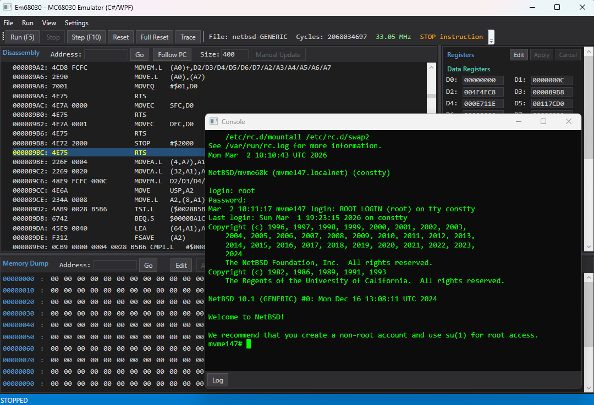

# Em68030 - MC68030 Emulator (C# / WPF)

[Motorola MC68030](https://en.wikipedia.org/wiki/Motorola_68030) マイクロプロセッサのエミュレータです。MC68030 は 1980 年代後半にワークステーションや組み込みシステムで広く使われた 32-bit CPU です。本エミュレータは MC68030 を搭載した VMEbus シングルボードコンピュータ [MVME147](https://en.wikipedia.org/wiki/MVME147) をエミュレートし、NetBSD の mvme68k ポートである [NetBSD/mvme68k](https://www.netbsd.org/ports/mvme68k/) を起動できます。

[Claude Code](https://docs.anthropic.com/en/docs/claude-code) との vibe coding により開発されました。

[English documentation (README.md)](README.md)



## 特徴

### CPU エミュレーション
- MC68030 の全命令セット (特権命令を含む)
- MMU (ページテーブルウォーク、ATC、透過変換、PTEST)
- MC68882 互換 FPU (FP0-FP7、FPCR/FPSR/FPIAR)
- バスエラー回復 (Format A スタックフレーム)

### ボードエミュレーション (MVME147)
| デバイス | エミュレーション |
|---|---|
| WD33C93 SCSI コントローラ | ハードディスク・CD-ROM (複数台) |
| AM7990 LANCE Ethernet | 仮想ネットワーク (ARP/ICMP/TCP/UDP) |
| Z8530 SCC シリアル | VT100 ターミナルエミュレーション |
| Mk48t02 RTC | リアルタイムクロック |
| PCC | 割り込みコントローラ |

### デバッガ UI
- 逆アセンブリビュー (PC 自動追従、アドレスジャンプ)
- レジスタ表示・編集 (D0-D7, A0-A7, PC, SR, SSP, VBR, FP0-FP7)
- メモリダンプ・編集
- ブレークポイント
- コンソールウィンドウ (VT100 ターミナル、スクロールバック対応)
- ELF / S-Record / バイナリファイルの読み込み

### パフォーマンス
i7-13700 上で 34-36 MHz 相当のエミュレーション速度を達成。主な最適化:

- 65,536 エントリのオペコードデリゲートテーブル
- 頻出命令の専用ファストハンドラ (MOVEQ, MOVE.L, Bcc.B, RTS 等)
- ATC 直接参照のインライン高速パス
- データページキャッシュ (1 エントリ読み取りキャッシュ)

インタープリタ方式のため、1 命令あたりホスト CPU で多数のサイクルを消費します。C# の JIT コンパイラによるメソッドインライン化には限界があり、C++ ネイティブ版と比較して約 25% 低い速度となります。

## 必要環境

- Windows 10 以降
- .NET 8.0 SDK

## ビルド

```bash
dotnet build Em68030/Em68030.csproj -c Release
```

## テスト

```bash
dotnet test Em68030.Tests/Em68030.Tests.csproj -c Release
```

## 実行

```bash
dotnet run --project Em68030/Em68030.csproj -c Release
```

初回起動後、Settings メニューから `appsettings.json` が生成されます。

## 設定 (appsettings.json)

```json
{
    "BoardType": "MVME147",
    "MemorySize": 67108864,
    "Mvme147ScsiDisks": [
        { "Path": "path/to/scsi0.img", "ScsiId": 0 }
    ],
    "Mvme147ScsiCdromPath": "path/to/NetBSD-10.1-mvme68k.iso",
    "Mvme147ScsiCdromId": 3,
    "ConsoleScrollbackLines": 2000
}
```

| 設定項目 | 説明 | デフォルト |
|---|---|---|
| `BoardType` | `"Generic"` または `"MVME147"` | `"Generic"` |
| `MemorySize` | RAM サイズ (バイト) | 48 MB |
| `Mvme147ScsiDisks` | SCSI ディスクイメージのリスト (Path + ScsiId) | `[]` |
| `Mvme147ScsiCdromPath` | SCSI CD-ROM ISO イメージパス | `""` |
| `ConsoleScrollbackLines` | コンソールのスクロールバック行数 (0-100000) | 2000 |

## NetBSD の起動

1. NetBSD/mvme68k のディスクイメージを用意する
2. Settings で `BoardType` を `MVME147` に設定し、SCSI ディスクイメージのパスを指定
3. File > Open ELF から NetBSD カーネル (`netbsd-GENERIC`) を読み込む
4. Run (F5) で実行開始

## プロジェクト構成

```
Em68030_CsWpf/
├── Em68030_CsWpf.sln
├── Em68030/
│   ├── Core/           MC68030, MMU, Memory, InstructionDecoder, ALU, FPU
│   ├── IO/             SCSI, Ethernet, Serial, RTC, PCC 等のデバイス
│   ├── Config/         EmulatorConfig (appsettings.json)
│   ├── ViewModels/     MainViewModel
│   ├── Views/          ConsoleWindow, BreakpointsWindow, SettingsWindow
│   └── MainWindow.xaml メインデバッガ UI
└── Em68030.Tests/      xUnit テスト (102 tests)
```

## 制限事項

### CPU
- FPU の内部精度は 64-bit double で近似しており、MC68882 の 80-bit 拡張精度とは異なります。通常の OS 動作には影響しませんが、高精度浮動小数点演算では結果が異なる場合があります
- FPU パックド十進 (Packed Decimal) フォーマットは未実装です
- FSAVE/FRESTORE は簡易実装 (null/idle フレーム) です
- CACR/CAAR レジスタは読み書き可能ですが、ハードウェアキャッシュのエミュレーションは行いません
- PTEST レベル 0 の ATC 検索は簡易実装です
- 命令実行のサイクル精度は保証されません (サイクルカウントは計測用であり、タイミング制御には使用されません)

### デバイス
- **SCSI**: NetBSD が使用する標準コマンドのみ実装。SCSI-2 の全コマンドセットには対応していません
- **Ethernet**: 仮想ネットワークは ARP 応答、ICMP Echo (ping)、TCP/UDP エコーサーバのみ。ホスト OS のネットワークスタックへの接続 (TAP/ブリッジ) には対応していません
- **シリアル (SCC)**: ボーレートのシミュレーション、モデム制御信号 (RTS/CTS) はありません
- **RTC**: ホストのシステム時刻を返す読み取り専用実装です。ゲスト OS からの時刻設定は反映されません
- **NVRAM**: メモリ上のみで、ファイルへの永続化は行いません
- **PCC**: プリンタポートおよびウォッチドッグタイマは未実装です

### ボード
- VMEbus は未実装です
- ROM イメージなしでも NetBSD カーネルを直接ロード・実行できます (ブートスタブ内蔵)

## 今後の予定

- Ethernet: ホスト OS ネットワークへの接続 (TAP デバイス / ユーザモード NAT)
- FPU: 80-bit 拡張精度の正確なエミュレーション
- NVRAM のファイル永続化
- グラフィックス出力 (フレームバッファ)

## 関連プロジェクト

- [Em68030 C++/WinUI3 版](https://github.com/hha0x617/Em68030_WinUI3Cpp) - 同じエミュレータの C++/WinRT 実装 (より高速)

## ライセンス

[Apache License 2.0](LICENSE)
